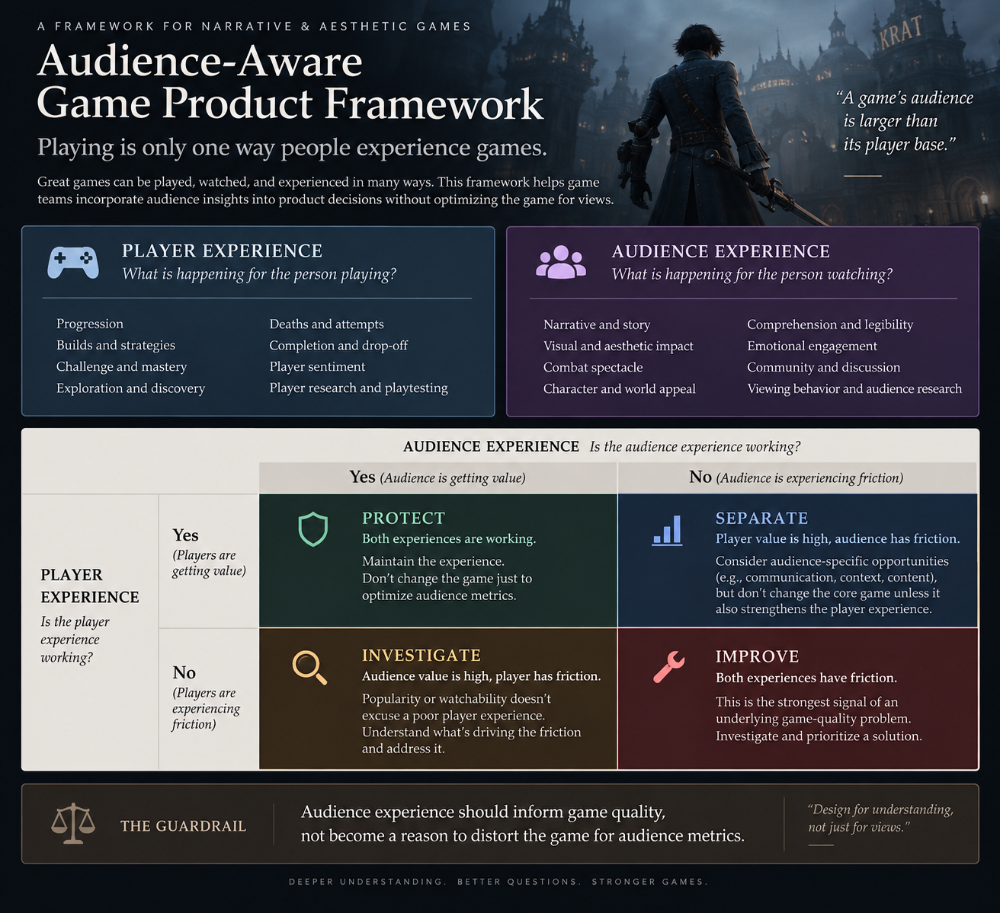

# Audience-Aware Game Product Framework

A product framework for incorporating non-playing audiences into narrative game decisions without optimizing the game for views.

## Playing is only one way people experience games

I watch far more games than I play.

I don't consider myself a gamer in the traditional sense. I play games sometimes, but much of my relationship with gaming comes from watching them.

I've watched difficult games while someone else holds the controller. I've watched playthroughs of games I had little intention of playing myself. I've followed creators whose communities matter more to me than whichever game happens to be on screen.

Sometimes I'm invested in the person playing.

Sometimes I want to understand the game.

And sometimes I put on a clean playthrough of an aesthetically beautiful game almost like ambient media.

That made me question an assumption embedded in how we often talk about games:

> **The person experiencing the game is the person playing it.**

That isn't always true.

---

## The observation started with difficult games

Games like Lies of P are particularly interesting to me because I enjoy watching combat I often don't want to execute myself.

I can still understand most of what is happening.

I can recognize when an attack lands versus when it is blocked or parried.

I notice how frequently the player has to heal.

Health bars tell me whether an attempt is progressing.

I can distinguish controlled play from someone attacking frantically.

I can recognize a sequence of well-executed actions even when I don't know the underlying inputs.

And much of what makes the experience compelling has nothing to do with whether I could perform it myself:

- boss and character design
- environments
- music
- animation
- effects
- environmental reactions to impact
- tension as health decreases
- anticipation of whether this attempt will finally succeed

That suggested an initial question:

> **What makes mastery and stakes legible to someone who isn't holding the controller?**

### Visual reference: Lies of P boss showcase

I used the official *Lies of P* Boss Fight Showcase as one observational reference for this study.

The footage helped me focus on what I could understand as an audience member without evaluating the combat as a player: attack anticipation, blocks and impacts, clean execution, visual force, environments and spectacle.

Because the video is an edited showcase of multiple boss encounters, I did not treat its editing or HUD presentation as representative of normal gameplay.

**Watch the official Lies of P Boss Fight Showcase:**  
https://www.youtube.com/watch?v=GzeHr_5XiGU

---

## But mastery wasn't the whole reason I watched

The question expanded once I compared different ways I consume games.

Watching someone I care about play creates investment in the player and their eventual success.

Watching a highly skilled player can make execution itself interesting.

Watching an unfamiliar playthrough can be about discovering the game.

Watching a creator can be primarily about the creator and their community.

And sometimes gameplay is simply pleasant to have on.

A clean playthrough of an aesthetically appealing game can function almost like environmental media for me: beautiful environments, music and movement in the background of an afternoon.

The same person can therefore watch games for completely different reasons.

That moved the study away from:

> Why do people watch games?

and toward:

> **What kind of experience are they trying to have in this particular viewing session?**

---

## Research changed the framework

Existing research on game spectatorship confirmed some of my observations and challenged others.

People watch games for overlapping reasons including entertainment, learning, social interaction, community, relaxation and escapism, suspense, novelty, skill appreciation and vicarious or narrative experience.

These motivations are not clean permanent audience segments.

The same person can move between them.

Research also exposed several things my initial framework underweighted.

### Suspense matters

Uncertainty itself can create spectator value.

Watching boss health fall while the player runs low on health or healing resources creates tension even when the spectator doesn't understand every mechanic.

### Narrative can be the experience

Research on "just watchers" documents people who experience game narratives through watching despite having little or no desire to play the games themselves.

Some still consider themselves participants in gaming culture.

### Watching can be ambient

There is qualitative evidence of gameplay videos being used as background media in ways compared to podcasts.

The research here is still thin, particularly compared with Twitch and esports research, so I treat ambient gameplay consumption as an area needing more study rather than a settled behavioral model.

### Context and intent are different

Watching a partner play on a couch is a context.

Watching for entertainment, learning, community or relaxation is an intent.

Those should not be collapsed into the same category.

---

# Playing is only one way people experience games

The research changed the premise of the project.

A person's relationship with a particular game might primarily involve playing it.

Or watching it.

Or both.

Someone can know its story, recognize its bosses, appreciate its mechanics, participate in discussion, recommend it and potentially purchase it without active play ever becoming their primary relationship with the game.

That doesn't make the player experience less important.

It means the game's audience can be larger than the population represented by gameplay telemetry.

---

## Does the game industry already design for this?

Yes, but unevenly.

Spectator-aware design is well established in competitive gaming and esports, where observer interfaces, spectator cameras, game-state information and broadcast readability have been explicit design concerns for years.

There are also meaningful examples outside competitive games.

Developers including Vlambeer and Supergiant have discussed making game state understandable to people watching.

During development of *Hades*, Supergiant explicitly considered what the game was like for someone who was "just watching" alongside the player experience.

That matters because it demonstrates that considering the audience does not inherently require turning a game into an esport or optimizing it for streaming.

But my research found much less documented evidence of non-playing audiences being treated as a design input in narrative and aesthetic single-player development.

For studios behind games such as *Lies of P*, *Clair Obscur: Expedition 33*, *Onimusha: Way of the Sword* and similar titles, public design discussions overwhelmingly frame combat, spectacle, environments, cinematics and readability around the player.

That does **not** prove those teams never consider watchers internally.

It means I could not find public evidence that audience-first consumption is routinely incorporated into their product and design practice.

That distinction matters.

---

## What this study adds

The existence of non-playing game audiences is not a new finding, and spectator-aware design is not a new practice.

The gap I found is narrower: there is limited documented evidence of audience-first consumption being operationalized in narrative and aesthetic single-player product decisions.

This project builds on that existing research with a product framework for a different question:

> **When player evidence and audience evidence align or diverge, how should that affect a game decision without turning audience metrics into game-design targets?**

---

# The product question

Game teams already have enormous amounts of evidence about players.

They can measure things such as:

- attempts
- deaths
- progression
- builds
- completion
- drop-off
- difficulty
- player behavior

But those systems cannot see someone sitting beside the player.

They cannot see someone watching an entire playthrough without ever launching the game.

And game telemetry alone cannot explain why a viewer watched for three hours, whether they were actively engaged, whether the game became background media, or what they valued about the experience.

So the product question became:

> **How should audience evidence inform game decisions without turning the game into something optimized for views?**

---

# Audience-Aware Game Product Framework

The framework starts with two evidence sets.

## Player experience

What is happening for the person playing?

Examples include:

- progression
- builds and strategies
- challenge and mastery
- exploration and discovery
- deaths and attempts
- completion and drop-off
- player sentiment
- research and playtesting

## Audience experience

What is happening for the person watching?

Examples include:

- narrative comprehension
- gameplay legibility
- aesthetic response
- mastery recognition
- suspense
- viewing behavior
- community discussion
- qualitative audience research

The goal is not to maximize both sets of metrics.

The question is:

> **What do they reveal about the underlying game experience?**

---

## 1. Both experiences are working: PROTECT

Imagine a difficult boss.

Players describe the encounter as challenging but fair and satisfying to master.

Audiences understand the stakes, recognize skillful responses and find the encounter compelling to watch.

Nothing needs to change simply because another version of the boss might generate more clips or views.

**Product response: protect the experience.**

Audience metrics are not automatically optimization targets.

---

## 2. Player value is high, audience friction exists: SEPARATE

Suppose mastering a boss requires many attempts.

For the player, repetition produces learning, adaptation and eventually a meaningful sense of accomplishment.

For someone watching, attempt twenty may no longer be particularly interesting.

Those experiences have diverged.

Making the boss easier might improve viewing progression while damaging the experience that makes the encounter valuable to the player.

**Product response: separate the problems.**

Look for audience-specific opportunities if they are worthwhile, but don't change the core game solely to improve spectator engagement.

---

## 3. Audience value is high, player friction exists: INVESTIGATE

The opposite can also happen.

A mechanic might generate dramatic clips, entertaining failures or substantial creator engagement while players consistently describe it as frustrating, confusing or unfair.

Popularity does not prove game quality.

**Product response: investigate the player problem.**

Spectator value shouldn't become justification for preserving a poor player experience.

---

## 4. Both experiences have friction: IMPROVE

This is where audience evidence may expose something fundamental about the game.

Suppose players struggle to read a boss's attacks and frequently describe deaths as unfair.

Spectators also struggle to distinguish attack telegraphs, successful responses and why the player took damage.

Both experiences point toward the same underlying issue:

**combat legibility.**

Improving animation, feedback or telegraphing may strengthen the game without reducing its intended difficulty.

**Product response: investigate the underlying game-quality problem.**

This is where audience research can become particularly valuable.

---

# The guardrail

> **Audience experience should inform game quality, not become a reason to distort the game for audience metrics.**

This distinction is important.

A boss does not need to become easier because repeated attempts lose viewers.

An environment does not need to change because another visual style performs better in clips.

A mechanic should not exist solely because it generates creator reactions.

But audience evidence can reveal things player telemetry cannot.

If both players and audiences struggle to understand an encounter, that may expose a communication problem.

If audiences consistently recognize and respond to a particular moment of mastery, that may reveal something the game communicates exceptionally well.

If people experience a game's world, story and aesthetics without playing it, that is still part of the cultural life of the game.

The audience is evidence.

It is not the optimization target.

---

# What this changes about telemetry

The framework doesn't require pretending game teams can instrument every person watching.

Most audience experiences happen outside the game.

Instead, I would think in three evidence layers.

## Game telemetry

What did players do?

Attempts, deaths, builds, progression, completion, retention and other behavioral signals.

## Audience evidence

What happened around the game?

Viewing behavior where available, creator/community patterns, discussion, audience research, comprehension and qualitative responses.

## Player and audience research

Why did those behaviors happen?

What did players value?

What did audiences understand?

Where did the experiences align or diverge?

These evidence sets answer different questions.

A player attempting a boss twenty times tells us what happened.

A viewer watching a three-hour playthrough tells us what happened.

Neither tells us what the behavior meant.

---

# Behavior is evidence, not meaning

This became the broader product principle behind the framework.

High playtime doesn't automatically mean a mechanic is valuable.

Repeated engagement doesn't automatically mean an activity is enjoyable.

High watch time doesn't automatically mean someone was paying close attention.

Millions of views don't automatically mean the underlying game should change to generate more of them.

Behavior is evidence.

Understanding **why** the behavior happened is what makes it useful for product decisions.

---

# What I would research next

The public evidence still leaves important questions unanswered.

I could not determine whether major narrative-game studios conduct internal research specifically with non-playing viewers.

I also found little public documentation showing narrative-game telemetry teams combining gameplay data with VOD or audience evidence to influence core game design rather than marketing, community or acquisition.

Those absences should not be interpreted as proof that the practices do not exist.

The next useful research would be original work with:

- people who primarily experience particular games by watching
- people who watch partners or friends play in person
- ambient/no-commentary gameplay viewers
- players and watchers experiencing the same encounters
- game developers and PMs working on narrative single-player titles

The most important question would not be:

> How do we make games more watchable?

It would be:

> **What can understanding the audience teach us about the game without compromising what makes the game worth playing?**

---

## Scope

This framework is specifically concerned with narrative, aesthetic and primarily single-player game experiences.

Competitive games and esports already have substantially more mature spectator-design practices and are useful evidence, but they are not the primary product context being explored here.

The framework is also not an argument that spectators and players should receive equal weight in every design decision.

Where their needs genuinely conflict, the intended player experience remains a critical constraint.

The goal is to stop treating non-playing audiences as invisible when their experience can tell us something meaningful about the game.

---

## Research

Supporting research and reasoning will live in:

- `research/findings.md` — spectator motivation research, industry-practice research, counterexamples and sources
- `research/reasoning-log.md` — observations, evolving hypotheses, corrections and the reasoning behind the framework
